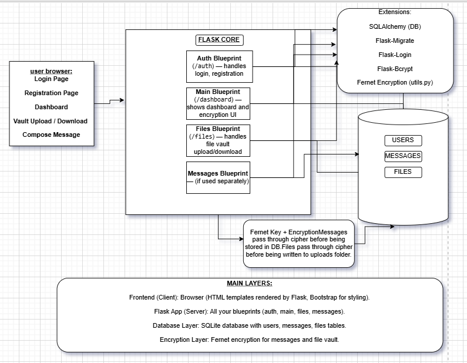

# 🔒 Secure Dashboard Project

A **secure web dashboard** built with **Flask**, demonstrating best practices in authentication, encryption, and modular architecture.

This project showcases:
✅ User authentication with Flask-Login & Flask-Bcrypt 
✅ Encrypted messaging using Fernet 
🔄 Encrypted file vault for secure uploads & downloads (in progress) 
✅ Modular structure with Flask Blueprints 
✅ RESTful API principles

---

## 📑 Table of Contents
- [Overview](#-overview)
- [Tech Stack](#-tech-stack)
- [Architecture](#-architecture)
- [Features](#-features)
  - [User Authentication & Logout](#-user-authentication--logout)
  - [Secure Messaging](#-secure-messaging)
  - [Encrypted File Vault (In Progress)](#-encrypted-file-vault-in-progress)
- [Setup & Installation](#-setup--installation)
- [Key Learnings](#-key-learnings)
- [Demo](#-demo)


---

## 📝 Overview

The **Secure Dashboard Project** demonstrates how to build a **secure, modular web application** with Flask.

It applies strong security practices for:
- **User authentication**
- **Encrypted messaging**
- **Secure file storage (vault)**

The application is designed with three main layers:
- **Frontend:** HTML/CSS templates using Bootstrap  
- **Flask Application Server:** Handles routing, authentication, encryption  
- **Database Layer:** SQLite with SQLAlchemy ORM  

---

## 🛠 Tech Stack

| Layer         | Tools / Libraries                                      |
|---------------|--------------------------------------------------------|
| **Backend**   | Python, Flask, Flask-Login, Flask-Bcrypt, Flask-Migrate |
| **Database**  | SQLite with SQLAlchemy ORM                              |
| **Frontend**  | HTML, CSS, Bootstrap                                    |
| **Encryption**| Fernet (from `cryptography` library)                    |
| **Structure** | Flask Blueprints for modularity                        |

---

## 🏗 Architecture

**Folder structure:**
```

secure-dashboard/
│
├── app/          # Core application code
├── auth/         # Authentication Blueprint
├── messages/     # Secure messaging Blueprint
├── files/        # File vault Blueprint (in progress)
├── instance/     # Runtime data (DB, keys, uploads)
├── templates/    # HTML templates
├── static/       # CSS, JS, static assets
└── run.py        # Entry point

````

This **modular structure** allows features to evolve independently while keeping the code clean.

**Architecture Diagram:**



---

## ✨ Features

### 🔐 User Authentication & Logout
- Handled by **Flask-Login**  
- Users log in and receive a **secure session cookie** containing a signed user ID  
- The cookie allows the app to remember the user across requests without repeated logins  

**Logout:**
- Dedicated route calls `logout_user()` from Flask-Login  
- Clears session cookie, revoking access to protected routes  

---

### 📨 Secure Messaging
Users can send **encrypted messages** to registered users.

**Sending a Message:**
1. Compose message and select a recipient  
2. Flask backend converts message to bytes and encrypts it with the **master Fernet key**  
3. Encrypted message stored as a **BLOB** in the database with sender & recipient IDs  

**Receiving a Message:**
1. Flask queries messages addressed to the user  
2. Each encrypted BLOB is decrypted using the **same master key**  
3. Decrypted message rendered on the dashboard  

✅ Messages are always stored encrypted in the database  

---

### 🗄 Encrypted File Vault (In Progress)
Provides a secure space for file uploads and downloads.

**Upload & Encryption (Completed):**
- File uploaded by user  
- Flask encrypts file binary data using the **master Fernet key**  
- Encrypted file saved in uploads folder  
- Metadata (filename, size) stored in database  

**Download & Decryption (Planned):**
- Server will retrieve encrypted file  
- Decrypt using master key  
- Stream original file to user  

---

## ⚙️ Setup & Installation

**Clone the repository:**
```bash
git clone https://github.com/yourusername/secure-dashboard.git
cd secure-dashboard
````

**Create virtual environment & install dependencies:**

```bash
python -m venv venv
venv\Scripts\activate   # Windows
pip install -r requirements.txt
```

**Configure environment variables & database:**

* Copy `.env.example` to `.env` and configure secrets (Fernet key, DB URI, etc.)
* Initialize the database if not already created

**Run the application:**

```bash
python run.py
```

---

## 🧠 Key Learnings

* Strong password hashing with Flask-Bcrypt
* Secure session management with Flask-Login
* Safe storage & retrieval of encrypted messages & files
* Modular Flask apps using Blueprints
* Database schema management using Flask-Migrate

---

## 🎥 Demo

* Project presented during Reverse KT session
* Session recorded and available for review


---

